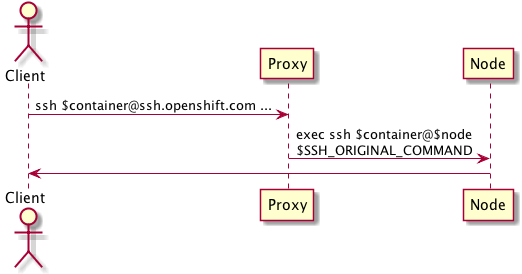

PEP: *number assigned by the arch board*  
Title: OpenShift 3 SSH Proxy  
Status: draft  
Author: Andy Goldstein <agoldste@redhat.com>  
Arch Priority: low|medium|high  
Complexity: 8, 13, 20, 40, 100 *story points*  
Affected Components: *web, api, runtime, cartridges, broker, admin_tools, cli*  
Affected Teams: Runtime (0-5), UI (0-5), Broker (0-5), Enterprise (0-5)  
User Impact: low|medium|high  
Epic: *url to a story, wiki page, or doc*  

Abstract
--------
Create a proxy service for users to access cluster resources via SSH. The proxy provides an abstraction from the physical location of the requested resource; if the resource moves, its URI remains unchanged, so clients don't have to update their configurations. Examples of cluster resources the proxy may support: Git repositories, SSH access to containers.

Motivation
----------
- Provide a consistent URI to cluster resources
- Allow resources to move within the cluster without requiring client configuration updates
- Avoid single points of failure


Specification
-------------
### SSH proxy components
The SSH proxy is comprised of the following pieces:

- sshd from OpenSSH
- a custom AuthorizedKeysCommand
- a custom executable to perform the proxying logic

### Basic flow
The SSH proxy accepts incoming requests from remote clients (users), asserts authentication and authorization, and forwards the requests to the appropriate backend cluster resources:



This is a simplified version of what actually happens, as we need to handle authentication, authorization, and determine to which backend resource the original request should be forwarded.

### A deeper dive
Let's look at what would happen for a Git clone request. First, the client would run a command such as

```
git clone $user@proxy.openshift.com:$repo
```

where $user is the login for that particular person and $repo specifies the Git repository in question.


`sshd` running in the proxy receives the request and performs the following sequence of steps relevant to OpenShift:


#### Step 1: user lookup via NSS
`sshd` looks up information about the user via the `getpwnam` system call. This uses NSS to retrieve the information based on the configuration in `/etc/nsswitch.conf`. The implication of this call is that the user exist in whatever data source NSS uses for the `passwd` database. More on that later...

#### Steps 2 & 3: retrieve user's authorized keys

The proxy configures `sshd` to use a custom `AuthorizedKeysCommand` to look up public keys for $user. This command runs as the user specified by `AuthorizedKeysCommandUser` - this user should only be used to perform this action. The custom `AuthorizedKeysCommand` makes a secure request to OpenShift to retrieve the public keys. The reason this command must run as a separate user is so that only this user is allowed to query OpenShift for the public keys for whatever user is requesting access. The `AuthorizedKeysCommandUser` has the appropriate permissions to ask OpenShift for public keys for all users (via a private SSL client certificate, a private token, or any other private means).

OpenShift returns a list of the public keys for the user in question, along with

- A session environment variable that uniquely identifies the user. This environment variable is generated automatically and stored in OpenShift and must never be shared.
- The command to be executed (the custom executable with the proxy logic). This command replaces whatever command the user originally requested; the user's command is available in `$SSH_ORIGINAL_COMMAND`.

#### Step 4: validate user's key
Using the public keys retrieved above, `sshd` determines if the user is authorized or not.

#### Step 5: execute proxy command
After the user has successfully logged in, `sshd` executes the command specified by the authorized key above, a custom executable that provides the proxying logic.

#### Steps 6 & 7: determine and execute backend plugin
The proxy examines `$SSH_ORIGINAL_COMMAND` to determine which backend plugin should handle the remainder of the session. In this example, the command is `git-upload-pack`, which is handled by the Git backend plugin.

#### Step 8: determine backend resource
The Git plugin 

#### Step 9: generate short-lived key
A user must only be allowed to access backend resources for which he/she has authorization. The user uses something only he/she knows (in this case, a private key) to authenticate to `sshd` in the proxy server, but once that happens, that piece of private data is not available in the proxy server itself (since the private key should only exist on the user's computer).

At this point, the SSH proxy needs to act as the user's agent to access a backend resource. This process must be as secure as possible, to eliminate any opportunity for an attacker to impersonate another user to gain access to resources the attacker otherwise would not be allowed to see (which could only potentially happen if they're able to somehow break out of the custom proxy executable process).

To mitigate this, the proxy creates a new SSH key pair for use solely with the current session.

#### Step 10: upload short-lived key to OpenShift
The plugin uploads the short-lived public key to OpenShift using the `$USER_REF` environment variable that was set as part of the authorized keys lookup above. This short-lived key grants the SSH proxy access to a specific backend resource for a very short amount of time. After the short-lived key has expired, OpenShift removes it automatically.

As mentioned before, `$USER_REF` is an auto-generated, random string that uniquely identifies a user. It should never be seen by anyone and only be used by the proxy executable. If a user did manage to see his/her `$USER_REF`, the only thing he/she could do with this knowledge would be to upload short-lived keys for resources the user is already authorized to access. If an attacker managed to see another user's `$USER_REF`, that would be a problem, as it would allow the attacker to gain access to the other user's backend resources. That is why it is critical that one user's `$USER_REF` value is not visible to other user's in the SSH proxy server. This isolation is achieved using SELinux and unique MCS labels per user; see the section on MCS labels below for more information.

#### Step 11: forward request to backend resource

### SSH proxy - sshd
sshd is the SSH server daemon the proxy uses to accept incoming SSH requests from remote clients.

To facilitate user audit logging and process isolation, the SSH proxy requires that a user use his/her own unique login when connecting to the proxy. Each Linux user gets its unique MCS label for SELinux; this is set as early as possible during the login process.

### passwd entries / getpwnam() / nsswitch
sshd requires that all users exist in the passwd database; more specifically, it must be possible to retrieve information for a user via the `getpwnam` method call. This method retrieves data from the sources specified in the `/etc/nsswitch.conf` file; the most common sources are probably:

- the `/etc/passwd` file
- LDAP

While the `/etc/passwd` file has less setup overhead than something like LDAP, especially for small deployments, this file would need to be  updated any time a user is added or removed to OpenShift's user database (TODO: .

### TODO non-human access to project resources???
can i from the UI add any ssh public key or token as having access to my git repo?
how to map the key back to a user?
entitled to access project's resources, but not a human

### MCS label assignment
TODO

### Changes to OpenShift API
- need to be able to store/retrieve public keys for users
- need to be able to store/retrieve temporary public keys

### need to address
- kerberos
- ldap for user & key mgmt?
- password/token auth
- load balancing
- nss/getpwnam

### rest
- can have multiple instances for redundancy sitting behind a load balancer
- [sshd] gets user info via getpwnam / NSS
- [sshd] invokes a custom AuthorizedKeysCommand to retrieve public keys from OpenShift for $project
- OpenShift returns public keys allowed to access $project, including a “user reference” environment variable for each key
- “User reference” is an unguessable string used to uniquely identify the user a particular key belongs to
- [sshd] launches custom login shell for $project (each process needs its own unique MCS label)
- custom login shell is an executable we write that handles communicating with the appropriate backend container
- [shell] generates single-use keypair and uploads it to OpenShift using “user reference” to specify the user
	- this is to make it as close to impossible as we can for a hacker who breaks out of the shell to generate key pairs for accessing other projects/users
- [shell] hands off control to a “Git plugin”
- [git plugin] queries OpenShift to determine in which Git backend container the repo lives
- [git plugin] uses single-use key to SSH to Git backend


Rationale
---------
*The technical rationale fleshes out the specification by describing what motivated the design and why particular design decisions were made. It should describe alternate designs that were considered and related work, e.g. how the feature is supported in other products.*

*The rationale should provide evidence of consensus within the community and discuss important objections or concerns raised during discussion.*