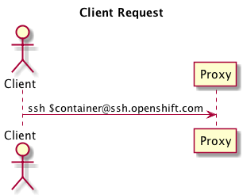
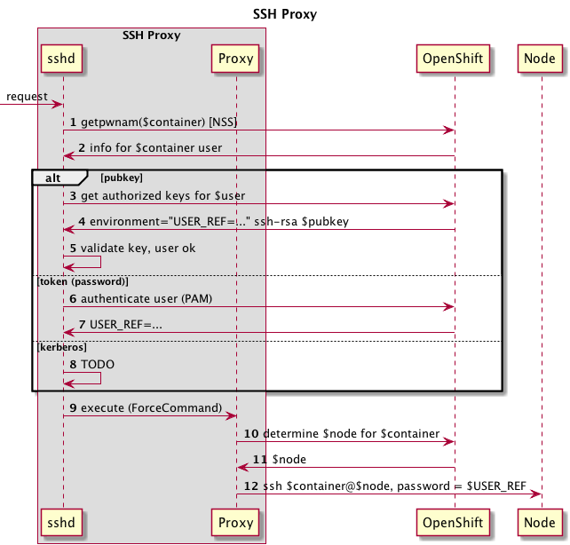
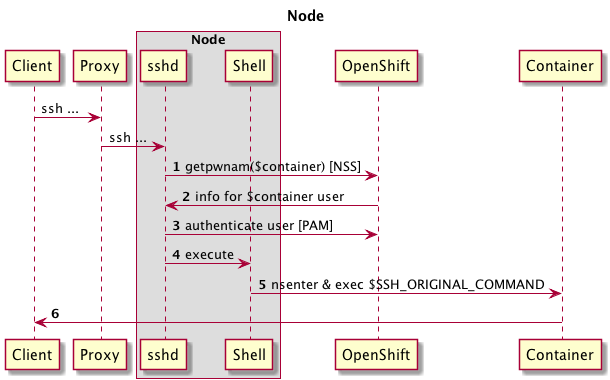

PEP: 014  
Title: OpenShift 3 SSH Proxy  
Status: draft  
Author: Andy Goldstein <agoldste@redhat.com>  
Arch Priority: medium  
Complexity: 40  
Affected Components: apiserver  
Affected Teams: Runtime, Infrastructure  
User Impact: low  
Epic: [SCM](https://trello.com/c/L1Df40pk/68-source-control-management-scm)

Abstract
--------
Create a proxy service for users to access cluster resources via SSH. The proxy provides an abstraction from the physical location of the requested resource; if the resource moves, its URI remains unchanged, so clients don't have to update their configurations. Examples of cluster resources the proxy may support: Git repositories, SSH access to containers.

Motivation
----------
- Provide a consistent URI to cluster resources
- Allow resources to move within the cluster without requiring client configuration updates
- Avoid single points of failure


Specification
-------------
### SSH proxy components
The SSH proxy is comprised of the following pieces:

- sshd from OpenSSH
- a custom AuthorizedKeysCommand
- a custom executable to perform the proxying logic, with plugins to support different backend resources

The SSH proxy is stateless, in as much as multiple proxies can exist behind a load balancer and/or something like round-robin DNS. Doing so eliminates the proxy layer from being a single point of failure.

--

### Basic flow
The SSH proxy accepts incoming requests from remote clients (users), asserts authentication and authorization, and forwards the requests to the appropriate backend cluster resources:


This is a simplified version of what actually happens, as we need to handle authentication, authorization, and determine to which backend resource the original request should be forwarded.

--

### A deeper dive
Let's look at what would happen for a Git clone request. First, the client would run a command such as

```
git clone $user@proxy.openshift.com:$repo
```

where $user is the login for that particular person and $repo specifies the Git repository in question.



`sshd` running in the proxy receives the request and performs the following sequence of steps relevant to OpenShift:



#### Step 1: lookup user via NSS
`sshd` looks up information about the user via the `getpwnam` system call. This uses NSS to retrieve the information based on the configuration in `/etc/nsswitch.conf`. The implication of this call is that the user exist in whatever data source NSS uses for the `passwd` database. More on that later...

#### Steps 2 & 3: retrieve user's authorized keys

The proxy configures `sshd` to use a custom `AuthorizedKeysCommand` to look up public keys for $user. This command runs as the user specified by `AuthorizedKeysCommandUser` - this user should only be used to perform this action. The custom `AuthorizedKeysCommand` makes a secure request to OpenShift to retrieve the public keys. This command is run as an isolated user to ensure only this user is allowed to query OpenShift for the public keys for which ever original user is requesting access. The `AuthorizedKeysCommandUser` has the appropriate permissions to ask OpenShift for public keys for all users (via a private SSL client certificate, a private token, or any other private means).

OpenShift returns a list of the public keys for the user in question, along with

- A session environment variable that uniquely identifies the user. This environment variable is generated automatically and stored in OpenShift and must never be shared.
- The command to be executed (the custom executable with the proxy logic). This command replaces whatever command the user originally requested; the user's command is available in `$SSH_ORIGINAL_COMMAND`.

#### Step 4: validate user's key
Using the public keys retrieved above, `sshd` determines if the user is authorized or not.

#### Step 5: execute proxy command
After the user has successfully logged in, `sshd` executes the command specified by the authorized key above, a custom executable that provides the proxying logic.

#### Steps 6 & 7: determine and execute backend plugin
The proxy examines `$SSH_ORIGINAL_COMMAND` to determine which backend plugin should handle the remainder of the session. In this example, the command is `git-upload-pack`, which is handled by the Git backend plugin.

Other backend plugins will perform different logic from this point forward. The steps below illustrate what the Git plugin workflow.

#### Step 8: determine backend resource
The Git plugin parses `$SSH_ORIGINAL_COMMAND` to determine which repo is being requested. The plugin then asks OpenShift for the URL of the backend pod where the repo lives.

#### Step 9: generate short-lived key
A user must only be allowed to access backend resources for which he/she has authorization. The user uses something only he/she knows (in this case, a private key) to authenticate to `sshd` in the proxy server, but once that happens, that piece of private data is not available in the proxy server itself (since the private key should only exist on the user's computer).

At this point, the SSH proxy needs to act as the user's agent to access a backend resource. This process must be as secure as possible, to eliminate any opportunity for an attacker to impersonate another user to gain access to resources the attacker otherwise would not be allowed to see (which could only potentially happen if they're able to somehow break out of the custom proxy executable process).

To mitigate this, the proxy creates a new SSH key pair for use solely with the current session.

#### Step 10: upload short-lived key to OpenShift
The plugin attempts to upload the short-lived public key to OpenShift using the `$USER_REF` environment variable that was set as part of the authorized keys lookup above. This short-lived key grants the SSH proxy access to a specific backend resource for a fixed amount of time. After the key's time-to-live has expired, OpenShift removes it automatically.

OpenShift checks to see if the user is allowed to access the specified Git repository. If so, OpenShift stores the key. If not, OpenShift returns an error to the plugin, and the plugin halts execution and returns the error to the user.

As mentioned before, `$USER_REF` is an auto-generated, random string that uniquely identifies a user. It should never be seen by anyone and only be used by the proxy executable. If a user did manage to see his/her `$USER_REF`, the only thing he/she could do with this knowledge would be to upload short-lived keys for resources the user is already authorized to access. If an attacker managed to see another user's `$USER_REF`, that would be a problem, as it would allow the attacker to gain access to the other user's backend resources. That is why it is critical that one user's `$USER_REF` value is not visible to other user's in the SSH proxy server. This isolation is achieved using SELinux and unique MCS labels per user; see the section on MCS labels below for more information.

#### Step 11: forward request to backend resource
The plugin next forwards the original request to the backend pod that has the repo.

--

### Backend flow - Git


#### Step 1: lookup user ($repo) via NSS
`sshd` looks up information about the user (in this case, the $repo) via the `getpwnam` system call. Each repo will have its own entry in `/etc/passwd`, managed by a helper process (see below for more information).

#### Steps 2 & 3: get authorized keys for $repo
`sshd` in the Git backend is configured to use a custom `AuthorizedKeysCommand` to look up public keys for $repo. This command runs as the user specified by `AuthorizedKeysCommandUser` - this user should only be used to perform this action. The custom `AuthorizedKeysCommand` makes a secure request to OpenShift to retrieve the public keys. The reason this command must run as a separate user is so that only this user is allowed to query OpenShift for the public keys for $repo. The `AuthorizedKeysCommandUser` has the appropriate permissions to ask OpenShift for public keys for all repos (via a private SSL client certificate, a private token, or any other private means). This ensures the proxy, acting as a real user's agent, is only authorized to access the repositories the real user is allowed to see.

OpenShift returns a list of the public keys for the repository in question.

#### Step 4: validate short-lived key
Using the public keys retrieved above, `sshd` determines if the proxy is authorized or not.

#### Step 5: execute shell
`sshd` executes the repository user's shell, `git-shell`

#### Steps 6 & 7: handle Git request
`git-shell` handles the Git request and returns the data back through the proxy to the client.

--

### passwd entries / getpwnam() / nsswitch
sshd requires that all users exist in the passwd database; more specifically, it must be possible to retrieve information for a user via the `getpwnam` method call. This method retrieves data from the sources specified in the `/etc/nsswitch.conf` file; the most common sources are probably:

- the `/etc/passwd` file
- LDAP

While the `/etc/passwd` file has less setup overhead than something like LDAP, especially for small deployments, this file would need to be updated any time a user is added or removed to OpenShift's user database.

### MCS label assignment

- ??? Mapping UID's from getpwnam() to SELinux context range, a la OpenShift v1|v2?

### Changes to OpenShift API
- add GitRepository type/registry/rest
- need to be able to store/retrieve public keys for users
- need to be able to store/retrieve short-lived keys, scoped to a specific resource

### SSSD integration?
Consider using SSSD in the SSH proxy container and the various backend containers (Git, etc.) to cache public keys.

Question: we don't really want to cache the short-lived keys, do we?

### Kerberos for authentication
TODO

### Token ("password") for authentication
TODO

### Git repository provisioning & management
A custom controller running in a Git backend pod watches the apiserver for new GitRepositories and creates the appropriate directories and files for the new repository.

If using `/etc/passwd`, the controller also adds an entry for the repository user to that file.

The controller could either run in the background in the same Git backend container that is running `sshd`, or it could run in a separate container that is part of the same pod, as long as the appropriate files and directories are shared between the containers (`/etc/passwd` and the base directory for all the git repositories, e.g. `/var/lib/git`).

### Recovery process
If a Git backend pod is lost unexpectedly, there must be a process to create a new pod to assume the duties of the previous one. The ideal way to handle this is to define a ReplicationController for the pod, and let OpenShift (Kubernetes) ensure the replica count is maintained at 1. If the pod dies, a replacement is created automatically as part of the replication controller functionality.

If the repository users are stored in `/etc/passwd`, this file must be bootstrapped appropriately.

The repositories themselves must be attached to the new Git backend container. This presumably will be handled as part of the replication controller replacement process. The repositories should be stored on a volume that can be detached from the lost pod and attached to the new one.

### Non-human access to project resources
TODO
- Can I from the UI add any ssh public key or token as having access to my git repo?
- How to map the key back to a user?
- Desire is to be able to give a non-human access to a project's resources